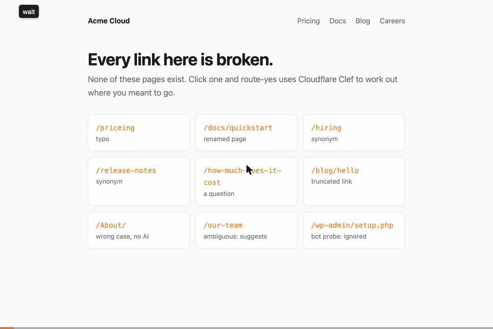

<p align="center">
  
  <br>
  <b>clef•ai•ry</b>
</p>

<h1 align="center">ry</h1>

<p align="center">
  <i>ry stands for <b>route yes</b>.</i><br>
  An AI router for 404s, built on <a href="https://blog.cloudflare.com/clef-decision-models/">Cloudflare Clef</a>.
</p>

<p align="center">
  <a href="https://route-yes-example.burcs.workers.dev"><b>Try the live demo</b></a>
</p>

<p align="center"></p>

When someone lands on a page that doesn't exist, ry asks Clef which real page they meant and sends them there.

```
/priceing            → /pricing/                typo
/docs/quickstart     → /docs/getting-started/   renamed page
/release-notes       → /changelog/              synonym
/About/              → /about/                  fixed without AI
/our-team            → "did you mean About or Careers?"
/wp-admin/setup.php  → 404                      bot probe, ignored
```

## Why Clef

Clef is a decision model, not a chatbot. You hand it a list of options and it returns a probability for each one. That makes it a good fit here:

- **It can't make up a URL.** Your pages are the options, so Clef can only pick one of them, or "none".
- **The probabilities mean something.** ry redirects when Clef is sure, suggests pages when it's torn, and leaves the 404 alone otherwise.
- **One call does two jobs.** The same request asks whether the visitor looks like a person or a bot scanning for `/wp-admin`.

## Quick start

```sh
npm i route-yes
```

**1. List your pages at build time.** This writes `route-yes.json` with every page's path, title, and description.

| Framework | Add |
| --- | --- |
| Vite (React, Vue, Svelte, TanStack Router, React Router…) | `plugins: [routeYes()]` from `route-yes/vite` |
| Astro | `integrations: [routeYes()]` from `route-yes/astro` |
| Anything else | `npx route-yes manifest dist` after your build |

The Vite plugin reads built HTML, `sitemap*.xml`, and TanStack's `routeTree.gen.ts`. Add pages it can't see with `routeYes({ routes: ["/pricing"] })`.

**2. Route 404s in your Worker.**

```ts
import { withRouteYes } from "route-yes/worker";

// Static site: serves from ASSETS and routes the misses
export default withRouteYes();

// SSR framework: wrap its handler instead
// export default withRouteYes(handler);
```

**3. Add the bindings.**

```jsonc
// wrangler.jsonc
{
  "assets": {
    "directory": "./dist",
    "binding": "ASSETS",
    "not_found_handling": "none"
  },
  "ai": { "binding": "AI" },
  // Optional: caches decisions so repeat visits skip Clef
  "kv_namespaces": [
    { "binding": "ROUTE_YES_CACHE", "id": "…" }
  ]
}
```

> [!IMPORTANT]
> `not_found_handling` must be `"none"`. With `404-page` or `single-page-application`, Cloudflare answers missing pages before your Worker runs. ry still serves your `404.html` when it doesn't redirect.

### Single-page apps

In a single-page app the 404 happens in the browser, so your not-found view asks the Worker:

```ts
import { routeYes } from "route-yes/client";

// e.g. in TanStack Router's notFoundComponent
const decision = await routeYes({ navigate: (to) => navigate({ to, replace: true }) });
// No confident match? Show decision.suggestions instead.
```

Add `"run_worker_first": ["/_route-yes/*"]` to `assets` so those requests reach the Worker.

## How ry decides

1. **Fix the easy ones.** Differences in case, slashes, `.html`, or `/index` get a 301 without calling Clef.
2. **Skip the noise.** Asset requests and obvious probes (`.env`, `.php`, `wp-admin`) keep their 404.
3. **Shortlist.** A quick text match picks the 60 likeliest pages, which keeps the Clef call small.
4. **Ask Clef** which page the visitor meant (or none), and whether they look like a person.
5. **Act.** ry sends a 302 when the top page scores 0.7 or higher, or 0.5 and three times the runner-up. Weaker matches get a "did you mean" page. The query string is kept on redirects.
6. **Cache** each decision by path in memory, the Cache API, and KV. Redeploying with changed pages clears it.

Every response gets an `x-route-yes` header with the decision, the confidence, and how long Clef took. If anything fails, the visitor gets your normal 404.

## Options

```ts
withRouteYes(handler, {
  model: "clef-flash",           // or "clef", the larger model
  minConfidence: 0.7,            // always redirect at or above this
  minDominantConfidence: 0.5,    // ...or above this when it's
  dominance: 3,                  //    3x likelier than the runner-up
  minHumanLikelihood: 0.5,       // below this, treat the visitor as a bot
  siteDescription: "…",          // one line about your site; helps with vague paths
  fallback: "suggest",           // or "passthrough" to always show your own 404
  renderMiss: (decision) => …,   // your own "did you mean" page
  cacheTtl: 86400,               // seconds; 0 turns caching off
  aiStatus: 302,                 // a model guessed, so not permanent by default
  onDecision: (decision) => …,   // logging or analytics
});
```

The resolver also works outside Workers, through the REST API:

```sh
CLOUDFLARE_ACCOUNT_ID=… CLOUDFLARE_API_TOKEN=… npx route-yes try /priceing
```

## Good to know

- **Speed.** During launch week, uncached Clef calls took 0.5 to 5 seconds, not the ~40ms Cloudflare advertises. Cached paths skip Clef, so bind KV. The Cache API doesn't work on `*.workers.dev`.
- **Borderline paths can flip.** Confidence varies a little between calls, so a path near the threshold might redirect once and show suggestions another time. Whichever answer comes first is cached.
- **Your page copy matters.** Clef reads your titles and meta descriptions. A homepage description that mentions every section pulls guesses toward the homepage.
- **Cost.** Clef only runs for page visits that 404, once per path per cache period. On a public site, add [rate limiting](https://developers.cloudflare.com/workers/runtime-apis/bindings/rate-limit/) so floods of random URLs can't run up your bill.
- **Safety and SEO.** ry only redirects to pages in your manifest, so it can't be used as an open redirect. AI redirects are 302s, and the suggestions page is `noindex`.
- **Dynamic routes** like `/posts/:id` aren't redirect targets. Prerendered pages and sitemap entries are.

## Develop

```sh
pnpm install && pnpm test
cd examples/vite-site && pnpm dev   # runs the demo against real Clef
```
